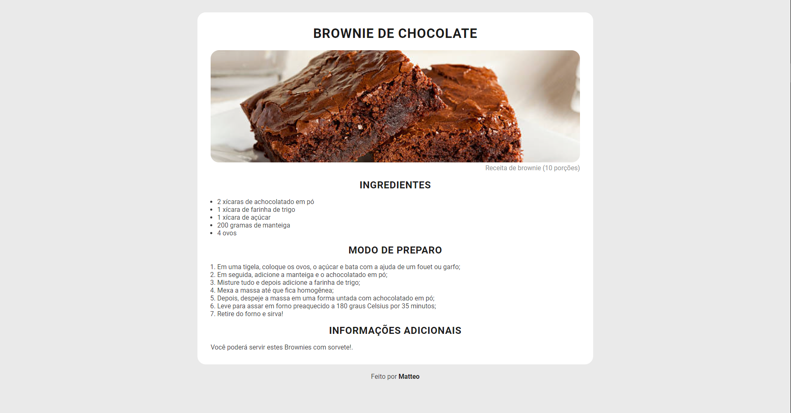

<h1 align="center"> Cook+ </h1>

Página feita do zero com base nos conhecimentos adquiridos até o momento.

  <a href="#-tecnologias">Tecnologias</a>&nbsp;&nbsp;&nbsp;|&nbsp;&nbsp;&nbsp;
  <a href="#-projeto">Projeto</a>

  

## 🚀 Tecnologias

Esse projeto foi desenvolvido com as seguintes tecnologias:

- HTML e CSS
- JavaScript
- Git e Github

## 💻 Projeto

O Cook+ é uma página de receitas simples e direto ao ponto.

- [Acesse o projeto finalizado, online](https://matvzn.github.io/CookPlus/)
 

---
Feito por Matteo